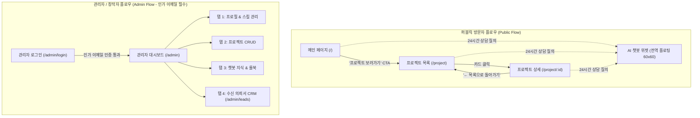

# 📐 [UI_SPEC] InterFolio UI/UX 통합 설계 및 명세서

> **문서 버전**: v1.0 (Master Integrated UI Specification)  
> **최종 수정일**: 2026-09-15  
> **기반 PRD**: [PRD.md](./PRD.md)  
> **디자인 가이드**: [DESIGN_GUIDE.md](./DESIGN_GUIDE.md)  

---

## 📌 문서 개요 (Executive Summary)

본 문서는 **InterFolio(인터뷰폴리오)** 웹 서비스의 **전체 사이트 구조(사이트맵), 각 화면별 UI 컴포넌트 명세, AI 챗봇 위젯 인터랙션, 그리고 디자인 시스템 규칙(DESIGN_GUIDE)**을 하나의 완성된 체계로 통합 정리한 마스터 UI 명세서입니다.

AI 코딩 어시스턴트 및 프론트엔드 엔지니어의 컨텍스트 윈도우 관리를 위해, 각 세부 영역별 심층 문서는 아래의 모듈 링크를 통해 즉시 참조할 수 있습니다.

### 📚 세부 UI 모듈 바로가기 (Module Navigation)
- 🏠 **[메인 페이지 UI 명세서]**: [`docs/ui_spec_main_page.md`](./docs/ui_spec_main_page.md)
- 📁 **[프로젝트 목록/상세 UI 명세서]**: [`docs/ui_spec_project.md`](./docs/ui_spec_project.md)
- 💬 **[AI 챗봇 위젯 UI 명세서]**: [`docs/ui_spec_chatbot_widget.md`](./docs/ui_spec_chatbot_widget.md)
- 🛡️ **[관리자 페이지 UI 명세서]**: [`docs/ui_spec_admin.md`](./docs/ui_spec_admin.md)
- 🎨 **[디자인 시스템 가이드]**: [`DESIGN_GUIDE.md`](./DESIGN_GUIDE.md)

---

## 1. 사이트맵 및 정보 구조 (Information Architecture & Sitemap)



| 화면명 | URL 경로 | 주요 사용자 | 핵심 역할 |
| :--- | :--- | :---: | :--- |
| **메인 페이지** | `/` | 잠재 고객 / 일반 | 창작자 프로필, 한 줄 소개, 보유 스킬, 경력 타임라인, 대표 CTA |
| **프로젝트 목록** | `/project` | 잠재 고객 / 클라이언트 | 카테고리별 작업물 필터링 및 카드 그리드 탐색 |
| **프로젝트 상세** | `/project/[id]` | 잠재 고객 / 클라이언트 | 큰 대표 이미지, 상세 설명, 기술 스택, 라이브 링크, 이전/다음 이동 |
| **AI 챗봇 위젯** | 전역 플로팅 | 잠재 고객 / 클라이언트 | 24시간 실시간 질의응답, 무관 질문 가드레일 방어, 견적 상담 및 의뢰서 접수 |
| **관리자 로그인** | `/admin/login` | 인가된 창작자/관리자 | 이메일/비밀번호 인증 및 화이트리스트 접근 제어 |
| **관리자 대시보드** | `/admin` | 인가된 창작자/관리자 | 프로필, 프로젝트 CRUD, 룰북 및 챗봇 지식 베이스(KB), 의뢰서 관리 |

---

## 2. 각 화면별 UI 상세 명세 (Screen Specifications)

### 2.1 메인 페이지 (`/`)
- **목적**: 창작자의 전문성과 신뢰도를 한눈에 전달하고 포트폴리오 탐색(`/project`) 및 AI 상담으로 연결.
- **주요 레이아웃 및 섹션**:
  1. **상단 GNB**: 좌측 텍스트 로고 + 우측 네비게이션 메뉴 (`About`, `Skills`, `Experience`, `Projects`, `AI 상담`)
  2. **히어로 섹션 (Hero)**:
     - **프로필 사진**: 정확히 **200px × 200px 원형** (`rounded-full border-2 border-primary/20 object-cover shadow-md`)
     - **텍스트 블록**: 직군 라벨 + 이름(36~44px Bold) + 한 줄 소개문
     - **메인 CTA 버튼**: **'프로젝트 보러가기'** ➔ 클릭 시 `/project`로 이동
  3. **스킬 섹션 (Skills)**: 모서리가 둥근 캡슐형 뱃지(`rounded-full bg-secondary text-secondary-foreground border`) 나열
  4. **경력 섹션 (Experience)**: 수직 타임라인 형태 (연도 | 회사명 | 역할 | 간략 성과 설명)
  5. **푸터 (Footer)**: 연락처 정보(메일, 전화) + SNS 링크 아이콘 + InterFolio 바이럴 뱃지
- **반응형 동작**:
  - **모바일 (< 768px)**: 1열 수직 배치 (200×200 사진 중앙 정렬) + 햄버거 메뉴 오버레이 드로어
  - **데스크톱 (≥ 1025px)**: 히어로 좌우 2열 분할 (사진 좌측, 텍스트 우측) + 가로 GNB 상시 노출

---

### 2.2 프로젝트 목록 페이지 (`/project`)
- **목적**: 창작자의 전체 포트폴리오를 카테고리별로 정돈하여 보여주는 쇼케이스 공간.
- **주요 컴포넌트**:
  1. **카테고리 필터 버튼 그룹**: `[전체]` `[웹]` `[앱]` `[디자인]` `[브랜딩]` `[기타]` (활성 버튼: Primary 배경 강조)
  2. **프로젝트 카드 (Project Card)**:
     - **썸네일 이미지**: 16:9 와이드 비율 고정 (`aspect-video object-cover rounded-t-xl`)
     - **카테고리 뱃지**: 썸네일 상단 또는 본문 상단 미니 뱃지
     - **프로젝트 제목**: Font-bold 20px (1줄 말줄임)
     - **간략 설명**: 14px 텍스트 (2줄 말줄임 `line-clamp-2`)
     - **호버 인터랙션**: 마우스 오버 시 **미세 확대(`scale-[1.02]`) + 인디고 그림자 번짐(`shadow-xl shadow-primary/10`)**
     - **클릭 동작**: 상세 페이지인 **`/project/[id]`**로 즉시 이동
- **반응형 그리드**:
  - 모바일: **1열 세로 배치 (`grid-cols-1`)**
  - 태블릿: **2열 그리드 (`grid-cols-2`)**
  - 데스크톱: **3열 그리드 (`grid-cols-3`)**

---

### 2.3 프로젝트 상세 페이지 (`/project/[id]`)
- **목적**: 특정 프로젝트의 기획 의도, 기술 스택, 성과, 시각 자료를 깊이 있게 탐색.
- **주요 컴포넌트**:
  1. **상단 네비게이션**: `← 전체 프로젝트 목록` 뒤로가기 링크 + 카테고리 뱃지
  2. **프로젝트 헤더**: 풀네임 제목 + 메타정보(기간, 역할, 고객사)
  3. **큰 대표 이미지**: 최대 16:9 와이드 고해상도 이미지 (`rounded-2xl border shadow-lg`)
  4. **상세 본문 (Content)**: 개요 ➔ 문제 정의 ➔ 솔루션 ➔ 수치 기반 핵심 성과
  5. **사이드바 / 메타 패널**:
     - **사용 기술 (Tech Stack)**: 기술명 뱃지 리스트 (`Next.js`, `TypeScript`, `Supabase` 등)
     - **관련 링크**: `[웹사이트 방문하기 ↗]`, `[GitHub 코드 보기 ↗]` 등
  6. **하단 페이지네이션**: `[← 이전 프로젝트]` | `[다음 프로젝트 →]`
- **반응형 동작**:
  - 모바일: 1열 수직 스택 (이미지 ➔ 본문 ➔ 사용기술 및 링크 하단 배치)
  - 데스크톱: 2열 분할 레이아웃 (좌측 65% 본문, 우측 35% 스티키 메타 패널)

---

### 2.4 AI 챗봇 위젯 (Chatbot Widget)
- **위치**: 전역 모든 화면 우측 하단 고정 플로팅 (`fixed bottom-6 right-6 z-50`)
- **닫힌 상태**: **원형 60px × 60px** 플로팅 버튼 (`rounded-full bg-primary text-primary-foreground shadow-2xl hover:scale-110`)
- **열린 상태 레이아웃**:
  - 데스크톱: **400px × 500px** 윈도우 (`rounded-2xl shadow-2xl border bg-card flex flex-col`)
  - 모바일: **전체화면 (100dvh Full-screen)** (가상 키보드 팝업 시 입력창 밀림 완벽 대응)
- **상태별 UI 명세**:
  - **상단 헤더**: `🤖 포트폴리오 AI 어시스턴트` (초록 펄스 점) + `[✕]` 닫기 버튼
  - **초기 메시지**: *"안녕하세요! [창작자명] 작가님의 AI 어시스턴트입니다. 포트폴리오나 견적, 일정에 대해 궁금한 점이 있으시면 편하게 질문해 주세요! 😊"* + 추천 질문 칩 3종
  - **로딩 상태**: 답변 생성 중 말풍선 내 3개의 점이 튀어 오르는 바운스 타이핑 애니메이션 (`animate-bounce`)
  - **무관한 질문 방어 (가드레일)**: 포트폴리오 무관 질문 시 정형 메시지 출력:
    > *"죄송합니다. 저는 [창작자명] 작가님의 포트폴리오 및 프로젝트 의뢰와 관련된 내용에만 답변드릴 수 있습니다. 작업 스타일, 견적, 협업 방식에 대해 궁금한 점이 있으시다면 언제든 말씀해 주세요!"*
  - **하단 입력 바**: `textarea` (Enter 전송, Shift+Enter 줄바꿈) + 전송 버튼

---

### 2.5 관리자 페이지 (`/admin/login`, `/admin`)
- **접근 제어 (FEAT-06)**: 사전 지정된 인가 이메일(`ALLOWED_ADMIN_EMAILS`) 계정만 접근 허용. 비인가자 진입 시 즉시 403 차단.
- **로그인 화면 (`/admin/login`)**:
  - 중앙 카드 레이아웃: 이메일/비밀번호 입력 폼 + 로그인 버튼 + 인가 계정 안내 문구
- **대시보드 화면 (`/admin`)**:
  - **좌측 사이드바 (240px)**: 프로필 관리, 프로젝트 관리, 챗봇 데이터 관리, 수신 의뢰서(Leads), 로그아웃
  - **탭 1: 프로필 관리**: 자기소개, 스킬 태그 추가/삭제, 경력 타임라인 수정 폼
  - **탭 2: 프로젝트 관리**: 프로젝트 목록 테이블 + `[+ 새 프로젝트 추가]` 모달 (제목, 설명, 카테고리, 이미지 업로드, 관련 링크)
  - **탭 3: 챗봇 데이터 관리**:
    - **룰북 설정**: 최소 수주 금액, 기본 작업 기간, 수주 불가 키워드
    - **지식 베이스(KB)**: AI가 참조할 FAQ/데이터 목록 CRUD (Supabase pgvector 실시간 임베딩 갱신)
  - **탭 4: 수신 의뢰서 CRM (`/admin/leads`)**: 카카오톡으로 발송된 클라이언트 의뢰서 목록 및 AI 대화 전문 열람

---

## 3. 디자인 시스템 가이드 (DESIGN_GUIDE 요약 통합)

### 3.1 컨셉 & 감성 톤
- **컨셉**: **Warm Minimalist Professional (웜 미니멀 프로페셔널)**
- **기본 모드**: **Dark Mode First (다크 모드 기본)**
- **감성 특징**: 차가운 블랙 대신, 미세한 온기가 도는 짙은 흑연색(Charcoal)에 신뢰감 있는 웜 인디고와 따뜻한 앰버(Gold) 포인트 부여.

### 3.2 핵심 색상 팔레트 (Color Palette)

| 역할 | 명칭 | HEX 코드 | 주요 적용처 |
| :--- | :--- | :---: | :--- |
| **Background** | Deep Warm Charcoal | `#0F1015` | 전체 페이지 기본 배경 (눈이 편안한 웜 다크) |
| **Surface / Card** | Elevated Warm Gray | `#191A23` | 프로젝트 카드, 모달, 챗봇 창 표면 |
| **Primary** | Warm Indigo | `#6366F1` | 주요 CTA 버튼('프로젝트 보러가기'), 활성 탭, 브랜드 강조 |
| **Secondary** | Warm Slate | `#262833` | 스킬 태그 뱃지 배경, 비활성 버튼 컨테이너 |
| **Accent** | Warm Amber | `#F59E0B` | **따뜻함의 포인트**: AI 챗봇 뱃지, 중요 하이라이트 |
| **Text (Primary)**| Soft Off-White | `#F3F4F6` | 메인 텍스트, 헤드라인 (눈부심 없는 오프화이트) |
| **Text (Muted)**  | Warm Muted Gray | `#9CA3AF` | 부제목, 날짜, 설명 메타정보 |
| **Border / Line** | Subtle Border | `#2B2D3A` | 카드 테두리, 구분선 (1px 미세 경계) |

### 3.3 타이포그래피 (Typography - Google Fonts 무료 상업용)
- **제목용 폰트 (Headings)**: **`Plus Jakarta Sans`** (Bold 700 ~ ExtraBold 800)
- **본문/UI 폰트 (Body)**: **`Inter`** (영문/UI) + **`Pretendard`** / **`Noto Sans KR`** (한글 본문)

### 3.4 간격 및 여백 (Spacing & Density)
- **간격 기준**: **`comfortable` (여유롭고 가독성 높은 호흡)**
- **섹션 상하 패딩**: `py-16 md:py-24` (80px ~ 96px)
- **카드 내부 패딩**: `p-5 md:p-6` (20px ~ 24px)
- **최대 콘텐츠 너비**: `max-w-6xl mx-auto px-4 sm:px-6 lg:px-8`

### 3.5 모서리 곡률 & 그림자 스타일 (Radius & Shadow)
- **모서리 스타일**: **`rounded` (부드러운 중간 곡률)**
  - 카드: `rounded-xl` (12px) ~ `rounded-2xl` (16px)
  - 버튼 & 인풋: `rounded-lg` (8px)
  - 뱃지 & 태그: `rounded-full` (캡슐형)
  - 챗봇 플로팅 버튼: `rounded-full` (60×60 원형)
- **그림자 스타일**: **`미세` (Subtle Depth + Border Highlight)**
  - 다크모드 특화: 1px 은은한 테두리(`border-[#2B2D3A]`) + 호버 시 인디고 글로우(`shadow-lg shadow-[#6366F1]/10`)

### 3.6 반응형 3단계 브레이크포인트 (Responsive Standards)

```text
  [ 모바일 (Mobile) ]         [ 태블릿 (Tablet) ]          [ 데스크톱 (Desktop) ]
      0 ~ 768px                 769 ~ 1024px                    1025px ~
 ──────────────────────   ─────────────────────────   ───────────────────────────
 • 1열 수직 레이아웃       • 2열 카드 그리드           • 3열 카드 그리드
 • 햄버거 메뉴 오버레이     • 축소형/접이식 사이드바    • 풀 네비게이션 메뉴 노출
 • AI 챗봇 전체화면       • 400x500 고정 챗봇         • 400x500 고정 챗봇
```

| 디바이스 | 해상도 범위 | 핵심 레이아웃 | GNB 네비게이션 | AI 챗봇 형태 |
| :--- | :---: | :---: | :---: | :---: |
| **모바일** | `0 ~ 768px` | 1열 수직 스택 | 햄버거 메뉴 오버레이 | **전체화면 (100dvh)** |
| **태블릿** | `769 ~ 1024px` | 2열 카드 그리드 | 가로 텍스트 / 축소 메뉴 | 400×500px 팝업 |
| **데스크톱** | `1025px ~` | 3열 카드 그리드 | 풀 네비게이션 상시 노출 | 400×500px 팝업 |

---

## 4. 컴포넌트 아키텍처 및 디렉터리 매핑 (Next.js 14)

```text
src/
├── app/
│   ├── layout.tsx                # 전역 레이아웃 (테마 프로바이더 + ChatbotWidget 포함)
│   ├── page.tsx                  # 01. 메인 페이지 (/)
│   ├── project/
│   │   ├── page.tsx              # 02. 프로젝트 목록 (/project)
│   │   └── [id]/
│   │       └── page.tsx          # 03. 프로젝트 상세 (/project/[id])
│   └── admin/
│       ├── layout.tsx            # 관리자 전용 레이아웃 (인가 이메일 미들웨어 검증)
│       ├── page.tsx              # 04. 관리자 통합 대시보드 (/admin)
│       ├── login/
│       │   └── page.tsx          # 05. 관리자 로그인 (/admin/login)
│       └── leads/
│           └── page.tsx          # 06. 수신 의뢰서 CRM (/admin/leads)
└── components/
    ├── navigation/               # Navbar, MobileNav, Footer
    ├── sections/                 # Hero, Skills, Experience
    ├── project/                  # ProjectCard, ProjectFilter, ProjectPagination
    ├── chatbot/                  # ChatbotWidget, ChatWindow, MessageList, ChatInput
    └── admin/                    # ProfileForm, ProjectTable, ProjectModal, RulebookForm
```

---

이 문서는 서비스 구현의 모든 시각적·기능적 인터랙션을 총망라한 **단일 기준점(Single Source of Truth)**입니다. 필요 시 상단의 모듈 링크를 통해 각 파트의 세부 코딩 가이드를 참조하십시오.

