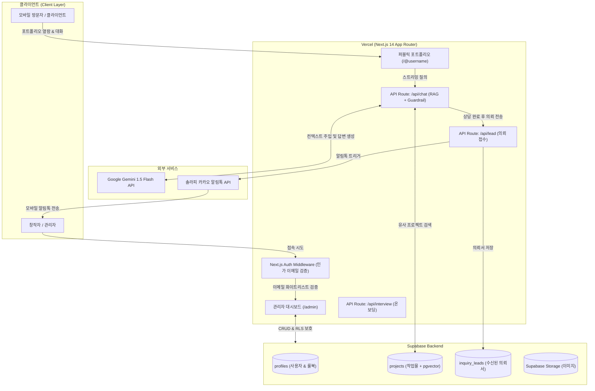

# [PRD Module 03] 기술 아키텍처 및 제약사항 (Technical Architecture)

> **상위 문서**: [마스터 PRD (PRD.md)](../PRD.md)  
> **이전 문서**: [02. 핵심 기능 명세 (02_feature_specifications.md)](./02_feature_specifications.md)  
> **다음 문서**: [04. 비기능 요구사항 및 모바일 최적화 (04_non_functional_and_mobile.md)](./04_non_functional_and_mobile.md)  
> **버전**: v1.1 | **상태**: 확정 (Approved)

---

## 1. 기술 스택 선정 및 제약조건 (Tech Stack Constraints)

### 1.1 필수 기술 스택
- **Hosting & Web Framework**: `Next.js 14+ (App Router)`, `TypeScript`, `Tailwind CSS`, `Shadcn UI` (배포: `Vercel`)
- **Backend & Database**: `Supabase`
  - Database: PostgreSQL (Managed)
  - Vector Engine: `pgvector` 확장 (프로젝트 임베딩 유사도 검색)
  - Auth: Supabase Auth (이메일 매직링크 / 소셜 로그인)
  - Storage: Supabase Storage (이미지 WebP 저장)
- **AI Engine**: `Google Gemini 1.5 Flash`
  - 온보딩 인터뷰 분석 및 포트폴리오 JSON 구조화
  - 방문자 실시간 대화 및 RAG 기반 질의응답 (Server-Sent Events 스트리밍)
  - 단가 룰북 가드레일 및 의뢰서 구조화 추출 (Structured Outputs)
- **External API (알림톡)**: `솔라피(Solapi)` 또는 카카오 비즈메시지 API

### 1.2 무료 및 극저비용 운영 원칙 (Zero Fixed-Cost Architecture)
- **Vercel Hobby Plan**: 웹 호스팅 및 서버리스 함수(Route Handlers) 무료 티어 활용.
- **Supabase Free Tier**: 500MB DB 용량, 1GB 파일 스토리지, 월 50,000 MAU 무료 활용.
- **Gemini 1.5 Flash**: 무료 티어(분당 15 RPM) 활용, 상용 전환 시에도 백만 토큰당 수십 원 대의 초저비용 구조 유지.
- **알림톡 실비**: 발송 건당 약 8~15원의 실비만 발생 (초기 소액 충전으로 MVP 및 테스트 전 과정 커버 가능).

---

## 2. 시스템 아키텍처 및 데이터 흐름



---

## 3. 데이터베이스 스키마 및 보안 정책 (PostgreSQL DDL)

```sql
-- 1. pgvector 확장 활성화
CREATE EXTENSION IF NOT EXISTS vector;

-- 2. profiles: 창작자 프로필 및 룰북 테이블
CREATE TABLE profiles (
  id UUID PRIMARY KEY REFERENCES auth.users(id) ON DELETE CASCADE,
  email TEXT UNIQUE NOT NULL,
  username TEXT UNIQUE NOT NULL,
  full_name TEXT NOT NULL,
  profession TEXT NOT NULL,
  bio TEXT,
  theme_preset TEXT DEFAULT 'modern_dark',
  rulebook JSONB DEFAULT '{
    "min_budget": 0,
    "min_duration_days": 7,
    "blocked_requests": ["무료 작업", "사후 정산", "불법 콘텐츠"]
  }'::jsonb,
  phone_number TEXT,
  is_admin BOOLEAN DEFAULT false,
  created_at TIMESTAMP WITH TIME ZONE DEFAULT NOW(),
  updated_at TIMESTAMP WITH TIME ZONE DEFAULT NOW()
);

-- 3. projects: 포트폴리오 작업물 및 벡터 임베딩 테이블
CREATE TABLE projects (
  id UUID PRIMARY KEY DEFAULT gen_random_uuid(),
  user_id UUID REFERENCES profiles(id) ON DELETE CASCADE,
  title TEXT NOT NULL,
  category TEXT NOT NULL,
  description TEXT NOT NULL,
  tags TEXT[] DEFAULT '{}',
  image_urls TEXT[] DEFAULT '{}',
  embedding VECTOR(768), -- Gemini 768차원 임베딩
  created_at TIMESTAMP WITH TIME ZONE DEFAULT NOW()
);

-- 코사인 유사도 검색 인덱스 생성
CREATE INDEX ON projects USING ivfflat (embedding vector_cosine_ops) WITH (lists = 100);

-- 4. inquiry_leads: 유효 의뢰서 및 대화 요약 테이블
CREATE TABLE inquiry_leads (
  id UUID PRIMARY KEY DEFAULT gen_random_uuid(),
  creator_id UUID REFERENCES profiles(id) ON DELETE CASCADE,
  client_name TEXT NOT NULL,
  client_contact TEXT NOT NULL,
  budget TEXT,
  timeline TEXT,
  summary TEXT NOT NULL,
  chat_log JSONB,
  status TEXT DEFAULT 'new', -- 'new', 'contacted', 'closed'
  created_at TIMESTAMP WITH TIME ZONE DEFAULT NOW()
);

-- 5. RLS (Row Level Security) 정책 설정
ALTER TABLE profiles ENABLE ROW LEVEL SECURITY;
ALTER TABLE projects ENABLE ROW LEVEL SECURITY;
ALTER TABLE inquiry_leads ENABLE ROW LEVEL SECURITY;

-- 포트폴리오는 누구나 공개 열람 가능 (Public Read)
CREATE POLICY "Public profiles are viewable by everyone" 
ON profiles FOR SELECT USING (true);

CREATE POLICY "Projects are viewable by everyone" 
ON projects FOR SELECT USING (true);

-- 관리자/소유자 본인만 본인 데이터 수정/삭제 가능
CREATE POLICY "Users can manage own profile" 
ON profiles FOR ALL USING (auth.uid() = id);

CREATE POLICY "Users can manage own projects" 
ON projects FOR ALL USING (auth.uid() = user_id);

-- 의뢰서(Leads)는 누구나 삽입 가능하지만, 열람은 창작자 본인만 가능
CREATE POLICY "Anyone can submit inquiry lead" 
ON inquiry_leads FOR INSERT WITH CHECK (true);

CREATE POLICY "Creators can view only own leads" 
ON inquiry_leads FOR SELECT USING (auth.uid() = creator_id);
```

---

## 4. 관리자 페이지 접근 제어 구현 메커니즘 (Next.js Middleware)

```typescript
// middleware.ts (관리자 접근 제어 예시)
import { createMiddlewareClient } from '@supabase/auth-helpers-nextjs';
import { NextResponse, type NextRequest } from 'next/server';

const ALLOWED_ADMIN_EMAILS = (process.env.ALLOWED_ADMIN_EMAILS || '').split(',');

export async function middleware(req: NextRequest) {
  const res = NextResponse.next();
  const supabase = createMiddlewareClient({ req, res });
  const { data: { session } } = await supabase.auth.getSession();

  // /admin 경로 진입 시 검증
  if (req.nextUrl.pathname.startsWith('/admin')) {
    if (!session) {
      return NextResponse.redirect(new URL('/login?error=unauthorized', req.url));
    }

    const userEmail = session.user.email || '';
    if (!ALLOWED_ADMIN_EMAILS.includes(userEmail)) {
      return NextResponse.redirect(new URL('/403-forbidden', req.url));
    }
  }

  return res;
}

export const config = {
  matcher: ['/admin/:path*'],
};
```

---
👉 **다음 단계**: [04_non_functional_and_mobile.md](./04_non_functional_and_mobile.md)에서 모바일 환경 최적화 및 비기능 요구사항을 확인하세요.

