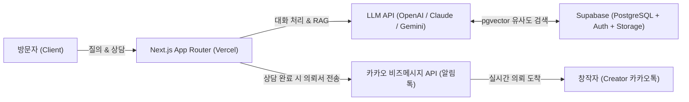

# 📋 [InterFolio / 인터뷰폴리오] 서비스 기획 종합 결과서 (PRD)

> **슬로건**: *"인터뷰로 5분 만에 완성되고, 24시간 대화로 일감을 따오는 AI 대화형 포트폴리오"*  
> **작성일**: 2026-09-13  
> **기획 파트너**: Antigravity × 기획자님  

---

## 1. 서비스의 목적 및 해결하고자 하는 문제 (Problem & Mission)

### 🚨 현 시장의 페인 포인트 (Pain Points)
1. **창작자/소상공인의 포트폴리오 제작 고통**:
   - 빈 화면(노션, 윅스, 워드프레스 등) 앞에서 자기소개와 프로젝트를 일일이 글로 작성하고 레이아웃을 잡는 데 막대한 시간과 스트레스 소모.
   - 웹 에이전시에 외주를 맡기자니 수백만 원의 비용 부담.
2. **24시간 응대의 한계와 본업 집중 불가**:
   - 1인 사업자/프리랜서는 낮에 현장 작업(시공, 디자인, 촬영, 미팅)을 하느라 수시로 걸려오는 단순 견적 문의에 제때 대응하기 어려움.
   - 밤늦은 시간이나 주말에 유입된 잠재 고객은 문의를 남기지 못하고 이탈.
3. **단순 '감상용' 웹사이트의 한계**:
   - 기존 포트폴리오는 일방적으로 보는 갤러리에 불과해, 클라이언트의 구체적인 요구사항(예산, 마감일, 스타일)을 검증하고 실제 계약으로 전환시키는 '영업력'이 전무함.

### 💡 InterFolio의 미션 (Solution)
- **AI 인터뷰를 통해 5분 만에 뚝딱 완성되는 포트폴리오**.
- **내 작업물과 단가 룰북을 완벽히 학습한 AI 어시스턴트가 24시간 상주하며 방문자를 상담하고, 정제된 '의뢰서'를 카카오톡으로 꽂아주는 세일즈 머신**.

---

## 2. 주요 사용자 및 페르소나 (Target Users)

| 구분 | 주요 타깃 | 핵심 니즈 & 이용 행태 |
| :--- | :--- | :--- |
| **공급자 (창작자)** | • 직군 불문 **1인 사업자 및 소상공인**<br>(마케팅 대행, 인테리어/공방, 전문 컨설팅, 디자인/영상 프리랜서 등) | • 복잡한 웹 제작 없이 빠르게 내 쇼케이스 구축<br>• 무리한 단가/일정 요구 사전 필터링<br>• 본업 중에도 놓치지 않는 실시간 신규 의뢰 수주 |
| **수요자 (방문자/고객)** | • 프로젝트를 의뢰하고자 하는 **기업 담당자, 스타트업 대표, 일반 고객** | • 복잡한 검색 없이 AI에게 "이 사람 어떤 일 하나요?", "비슷한 사례 있나요?" 즉시 질의<br>• 내 예산과 일정에 작업 가능한지 24시간 즉시 확인 및 상담 접수 |

---

## 3. 핵심 기능 (Core Features)

### 🥇 기능 1: [온보딩] AI 사전 인터뷰 기반 초고속 자동 빌더
- 빈 양식을 채울 필요 없이, AI와 5분간 편안하게 음성/채팅으로 대화(전문 분야, 대표 프로젝트, 일하는 가치관, 희망 단가 등).
- AI가 답변을 구조화하여 **프로필 페이지 + 프로젝트 쇼케이스 + 챗봇 지식 베이스(KB)**를 한 번에 자동 생성.

### 🥈 기능 2: [RAG] 포트폴리오 기반 사실 기반 질의응답 (Grounded AI)
- 방문자가 웹사이트에 들어와 질문하면 창작자의 실제 데이터를 기반으로 정확히 답변:
  - *"이 분은 주로 어떤 작업을 하나요?"*
  - *"유사한 F&B 브랜드 프로젝트 사례만 보여줘."*
  - *"협업할 때 소통 방식과 수정 횟수 정책은 어떻게 되나요?"*

### 🥉 기능 3: [세일즈] 사전 룰북 기반 24/7 AI 상담 & 카카오톡 의뢰서 발송
- **단가/작업 룰북 탑재**: 창작자가 사전에 정의한 최소 단가, 작업 소요 기간, 불가한 작업 유형 가드레일 내에서만 AI가 안전하게 응대 (할루시네이션 방지).
- **자동 리드 수집 & 카톡 알림톡**: 클라이언트의 예산·일정·요구사항을 AI가 인터뷰하여 창작자 카카오톡으로 **「신규 프로젝트 의뢰 리포트」** 실시간 즉시 발송.

---

## 4. 유사 서비스 대비 차별점 (Competitive Advantages)

```
[ 기존 포트폴리오 (Notion / Wix / Carrd) ] 
일방적 정보 나열 (Static) ──> 스크롤 후 이탈 ──> 창작자는 누가 봤는지 모름

[ InterFolio (인터뷰폴리오) ]
대화형 인터랙션 (Interactive) ──> AI 24시간 상담 ──> 실시간 카톡 의뢰서 수주 (Sales Funnel)
```

1. **빌딩 허들의 극단적 단축**: 며칠 걸리는 텍스트 작성과 레이아웃 배치 대신, **5분 AI 인터뷰 대화만으로 완성**.
2. **보는 웹사이트에서 '일하는 웹사이트'로의 진화**: 정적 쇼케이스가 아닌, **24시간 나를 대리해 일감을 따오는 전담 매니저**.
3. **한국 시장 특화 UX (카카오톡 알림)**: 이메일 확인 지연 문제를 해결하고, 의뢰 접수 즉시 창작자가 클라이언트에게 컨택할 수 있는 초고속 수주 환경 제공.

---

## 5. UI/UX 및 디자인 정책

- **방문자 인터랙션**: **상담 & 리드 수집 특화형 하이브리드 인터페이스** (시각적 프로젝트 카드 탐색과 AI 대화창이 유기적으로 연결).
- **비주얼 템플릿**: 직군별 감각적인 **원클릭 테마 프리셋 4~5종** 제공 (모던 다크, 클린 화이트, 에이전시 매거진, 아트 갤러리 등). 복잡한 캔버스 에디터 대신 1초 만에 완성도 높은 비주얼 선택 가능.

---

## 6. 기술 아키텍처 및 제약사항 (Technical Architecture)



- **Frontend**: `Next.js 14+ (App Router)`, `Tailwind CSS`, `Framer Motion`
- **Backend & Database**: `Supabase` (PostgreSQL, Supabase Auth, Storage, **pgvector 확장**)
- **AI / RAG Pipeline**:
  - LLM: `gpt-4o-mini` 또는 `Gemini 1.5 Flash` (비용 최적화 및 빠른 응답 속도)
  - 임베딩: `text-embedding-3-small` (프로젝트 데이터 벡터화)
  - 안전장치: 시스템 프롬프트 가드레일 + 사전 단가 룰북 매핑
- **외부 연동**: 솔라피(Solapi) / 알림톡 비즈니스 API

---

## 7. 비즈니스 모델 및 성장 전략 (PLG SaaS)

- **무료 플랜 (Free)**:
  - `interfolio.me/@username` 서브도메인 제공
  - 기본 포트폴리오 호스팅 및 월 기본 AI 대화 상담 제공
  - 하단에 *"Powered by InterFolio - 5분 만에 내 AI 포트폴리오 만들기"* 뱃지 노출 (자연 바이럴 유입 루프)
- **유료 프로 패키지 (Paid Package - 월 구독 또는 연 결제)**:
  - 커스텀 개인 도메인 연결 (`yourbrand.com`)
  - InterFolio 워터마크 뱃지 제거
  - 카카오톡 의뢰서 알림 무제한 및 심층 방문자 분석 리포트

---

## 8. 프로젝트 정보 및 빌딩 로드맵

- **개발 방식**: Antigravity와 함께하는 **1인 풀스택 페어 프로그래밍**
- **작업 페이스**: 마감 기한에 쫓기지 않고, 최신 풀스택 기술과 AI RAG 파이프라인의 원리를 체득하며 **완성도 위주로 차근차근 개발**
- **향후 단계별 실행 계획 (Roadmap)**:
  1. **Phase 1: 데이터 모델링 & DB 스키마 설계** (사용자, 프로젝트, AI 대화 로그, 의뢰서 테이블)
  2. **Phase 2: Next.js 프론트엔드 기본 구조 & 테마 프리셋 컴포넌트 구축**
  3. **Phase 3: 창작자 온보딩 AI 인터뷰 프로토타입 구현**
  4. **Phase 4: RAG 기반 방문자 질의응답 & 카카오톡 알림톡 파이프라인 연동**

